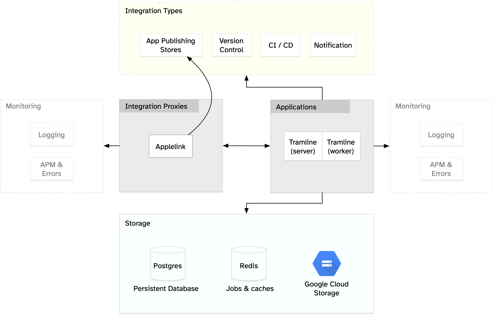
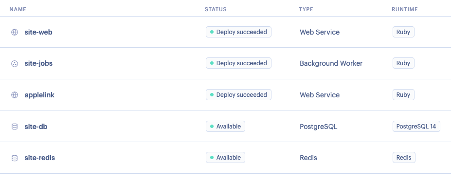

<p align="center">
  <picture>
    <source media="(prefers-color-scheme: dark)" srcset="art/tramline-fff-medium.png">
    
  </picture>
</p>

<h1 align="center">Tramline</h1>

<p align="center">
  <strong>Release apps without drowning in process</strong>
</p>

<p align="center">
  Codify your app's release cycle,<br/>
  deploy builds with increased confidence,<br/>
  and give visibility to the entire organization.<br/>
</p>

<p align="center">
  <a href="https://tramline.app" target="_blank" rel="noopener noreferrer">Website</a>
  ·
  <a href="https://tramline.substack.com" target="_blank" rel="noopener noreferrer">Latest Updates</a>
  ·
  <a href="https://tramline.app/blog" target="_blank" rel="noopener noreferrer">Blog</a>
</p>

<p align="center">
  <a href="https://twitter.com/tramlinehq/" target="_blank" rel="noopener noreferrer">
    
  </a>
  <a href="https://discord.gg/u7VwyvBV2Z" target="_blank" rel="noopener noreferrer">
    
  </a>

  <br/>
  <br/>

  <a href="https://github.com/tramlinehq/site/actions/workflows/ci.yml">
    
  </a>

  <a href="https://github.com/testdouble/standard">
    
  </a>

  <a href="CODE_OF_CONDUCT.md">
    
  </a>

  
</p>

## Features ✨

### Release dashboards

A centralized dashboard to monitor and control all your mobile releases, that gives visibility into the release process to all stakeholders.

### Release trains

Using the release train model, you can setup different types of releases as separate trains comprising of different steps. For e.g. your production release train can look completely different from the release train that does frequent internal deploys.

### Integrations

Connect with all the [essential tools](https://www.tramline.app/integrations) you use during your release cycle: version control, notifications, CI/CD (build) servers, distribution services, and both App Store and Play Store.

### Automations

Save time and reduce human error across the board by automating release-specific chores. For e.g.

- Create a new release branch for every release
- Create and merge release-specific branches, as determined by your branching strategy
- Submit build to the Store only after explicit approval
- Tag the final release build commit
- Don't allow starting a new release unless previous release-specific commits have landed in the working branch

### Analytics

Track and visualize release-specific metadata that you need to make informed decisions: release frequency, build times, review times, etc.


## How to set it up yourself ⚙️

These steps assume setting it up on [Render](https://render.com) only. However, the instructions are standard enough to be adapted for a [Heroku](https://heroku.com) deployment or even bare-metal. A Dockerized setup is in the works and will come shortly.

> [!NOTE]
> Since Render does not offer background workers under the free plan, you will have to put in your payment details to fully complete this deployment.

### Requirements

At minimum, you'll need the following to get Tramline up and running:

- This repository set up as the primary monolithic backend
- This repository set up as a background worker
- Postgres database
- Redis, preferably persistent

You'll also need to set up integrations for Tramline to be useful:

* [Postmark API token](https://postmarkapp.com/support/article/1008-what-are-the-account-and-server-api-tokens)
* [Google Cloud Service Account](https://kinsta.com/knowledgebase/google-cloud-storage-backup/#create-a-service-account)
* [Creating a Slack app](https://api.slack.com/authentication/basics)
* [Creating a GitHub app](https://docs.github.com/en/apps/creating-github-apps/creating-github-apps/creating-a-github-app)

### Setting up integration apps

The guides above should help you setup the OAuth apps as necessary. They may ask you to fill up a redirect URL, this URL should be updated with the final DNS after everything is setup towards the end.

### Google Cloud Platform

We need to setup GCP for storing builds in Tramline. After creating your service account as mentioned above, please create a GCS bucket named `artifact-builds-prod` to host your builds.

### Setting up Tramline

The deployment architecture looks like this:

<figure>
  
</figure>

To begin, first clone this repo. This ensures everything that you do is fully under your control.

In case you'd like to run this locally first, please follow the [local development instructions](#local-development-%EF%B8%8F).

To host Tramline directly, you'll need to prep your fork:

### Set up Rails

```bash
bin/setup.mac
```

### Generate production credentials and follow the instructions

```bash
bin/setup.creds -e prod
```

Keep the `production.key` file safe and don't commit it!

### Update production credentials

After adding the encryption credentials, fill in the following details for the integrations in `production.yml.enc` by running `bin/rails credentials:edit --environment production`.

Follow the links mentioned earlier to setup the bare-minimum integrations.

For `applelink`, choose any string as your `secret`. We will use this later.

Use the following template:

```yaml
active_record_encryption:
  primary_key:
  deterministic_key:
  key_derivation_salt:

secret_key_base:

dependencies:
  postmark:
    api_token:

  gcp:
    project_id:
    private_key_id:
    private_key: |
    client_email:
    client_id:
    client_x509_cert_url:

integrations:
  slack:
    app_id:
    client_id:
    client_secret:
    signing_secret:
    verification_token:
    scopes: "app_mentions:read,channels:join,channels:manage,channels:read,chat:write,chat:write.public,files:write,groups:read,groups:write,im:read,im:write,usergroups:read,users.profile:read,users:read,users:read.email,commands,usergroups:write"

  applelink:
    iss: "tramline"
    aud: "applelink"
    secret: "any password"

  github:
    app_name:
    app_id:
    private_pem: |
```
Save the credentials file and commit your changes. Use this button **from your fork** to kick-off a Render deployment.

<p>
  <a href="https://render.com/deploy" target="_blank">
  
  </a>
</p>

The blueprint will ask for the `RAILS_MASTER_KEY`. Use the contents of `production.key` from the previous step.

### Setup applelink

If you would like to use the App Store integration, you'd have to configure the `applelink` service. You can skip this section otherwise.

1. To start off, in your fork, uncomment the `applelink` section from the `render.yaml` file.
2. Secondly, to your encryption file, add this to the integrations section, by running `bin/rails credentials:edit --environment production`. Choose a secret key for authorization.

```yaml
integrations:
  applelink:
    iss: "tramline.dev"
    aud: "applelink"
    secret: "any password"
```

3. Commit your changes and resync the blueprint on Render. This will kick-off the `applelink` service. This will most likely fail to deploy on the first attempt, because it requires certain environment configuration. To do that, create a `Secret File` under `applelink > Settings > Environment > Secret Files` called `.env` and update with the following details by putting the applelink secret from the previous step under `AUTH_SECRET`:

```
RACK_ENV=production
WEB_CONCURRENCY=2
MAX_THREADS=1
PORT=3001
AUTH_ISSUER="tramline"
AUTH_AUD="applelink"
AUTH_SECRET=""
SENTRY_DSN=""
```

### Wrap up

Before we wrap up, we need to fix a couple of ENV variables:

1. If you have setup applelink in the previous step, you must add an `APPLELINK_URL` to `site-web` with the final DNS of the `applelink` service.
2. The `HOSTNAME` in `site-web` and `site-jobs` must be updated to point to the DNS of `site-web` (without the protocol).

Once all services on Render are green, your setup should look like this:

<figure>
  
</figure>

That should be it! You can use the default DNS from `site-web` to launch Tramline. You can configure and tweak more settings later.

## Local development 🛠️

### Env vars

First copy the sample env file,

```bash
cp .env.development.sample .env.development
```

`.env.development` is gitignored, so changes will remain local.

### Pre-requisites

For local development, clone this repository and install the following pre-requisites:

**docker**

Follow the instructions [here](https://docs.docker.com/engine/install/) to install docker on your machine if you don't have it already. We recommend using [Podman](https://podman.io) or [OrbStack](https://orbstack.dev) for managing containers locally.

**ngrok**

Setup an account (free or otherwise) [here](https://ngrok.com/). ngrok is required for using [webhooks](#webhooks) from our third-party integrations like GitHub, GitLab, Bitbucket, etc. Follow the instructions [here](https://ngrok.com/download) to install ngrok on your machine if you don't have it already. Add your token in `.env.development` under `NGROK_AUTHTOKEN`.

**justfile**

There's a `Justfile` that you can use to run common commands including starting the development environment, running specs, linting, etc.

Install `just` by following the instructions [here](https://github.com/casey/just?tab=readme-ov-file#installation).

**secret credentials**

If you're a **trusted contributor**, reach out to the existing developers for access to the dev `master.key`. Place the `master.key` file in the `config` directory or set `RAILS_MASTER_KEY` in `.env.development`.

If you're a **new external contributor**, run the following to setup your own credentials:

```bash
just pre-setup
```

This will setup the rails credentials via an interactive script. Once this is done, you should be able to boot up the application.

> [!NOTE]
> Booting is insufficient to make Tramline useful for dev, you'd have to setup some basic integrations as well. See [here](/integrations).

### Running

You can start your local development environment by running the following command:

```
docker compose up
```

Refer to `db/seeds.rb` for credentials on how to login using the seed users.

Below are some common commands you can use via `just`:

- `just start` – Starts the development environment
- `just spec` – Runs the specs
- `just lint` – Runs the linter
- `just rails command` – Runs a Rails command in the web container
- `just rake command` – Runs a Rake command in the web container
- `just bundle command` – Runs a Bundler command in the web container
- `just devlog` – Tails the development log
- `just bglog` – Tails the background worker log
- `just shell` – Opens a shell in any docker container

In case the above list is stale, run `just --summary` to see the full list.

### Integrations

Tramline is an integration-heavy service. It doesn't do much without some basic integration setup. Even though we connect to a lot of third-party services, for a basic development setup, only GitHub is truly necessary. So to setup an integration with GitHub, you must [create an OAuth GitHub app](https://docs.github.com/en/apps/creating-github-apps/registering-a-github-app/registering-a-github-app) first. And then run the following:

```bash
just rails credentials:edit
```

Fill the following content/section in the credentials file:

```bash
integrations:
  github:
    app_name:
    app_id:
    private_pem: |
```

> [!TIP]
> After saving credentials, restart the web service to take effect.

### Webhooks

Webhooks need access to the application over the Internet and that requires tunneling on the localhost environment. We use ngrok and it is started in the local development environment using Docker Compose.

### Adding or updating gems

* Use `just bundle add <gem>` to add a new gem.
* To update a gem use `just bundle update <gem>`.

> [!TIP]
> You might need to restart the web, sidekiq and/or css containers after adding or updating a gem.

Using the `just bundle add` tool auto-applies
the [pessimistic operator](https://thoughtbot.com/blog/rubys-pessimistic-operator) in the `Gemfile`.
Although `Gemfile.lock` is the correct source of gem versions, specifying the pessimistic operator makes for a simpler
and safer update path through bundler for future users.

Doing this for development/test groups is optional.

### Using pry

You can attach to a running container using the `just attach <service-name>` command.
Once attached, any pry session will be available in the container. To detach, press `ctrl-d`.

> [!WARNING]
> Killing the attached container will kill the container process. Ensure you use the right escape sequence for detaching.

The default service name is `web`, so you can use `just attach` to attach to the web container.

### SSL

We use SSL locally and certificates are also generated as part of the setup script. It's recommended to
use https://tramline.local.gd:3000.

This is the default `HOST_NAME` that can be changed via `.env.development` if necessary.

### Letter Opener

All e-mails are caught and can be viewed [here](https://tramline.local.gd:3000/letter_opener).

### Sidekiq

The dashboard for all background jobs can be viewed [here](https://tramline.local.gd:3000/sidekiq).

### Flipper

All feature-flags are managed through flipper. The UI can be viewed [here](https://tramline.local.gd:3000/flipper).

## Contributing 👩🏻‍💻

We are still in the early stages and would <3 any feedback you have to offer. You can get in touch with us in several ways:

- Join our [Discord](https://discord.com/invite/u7VwyvBV2Z) server to ask us questions or share your thoughts
- Submit a [feature request or bug report](https://github.com/tramlinehq/tramline/issues/new/choose)
- Open a pull request (see instructions for local setup [here](#local-development-%EF%B8%8F))
